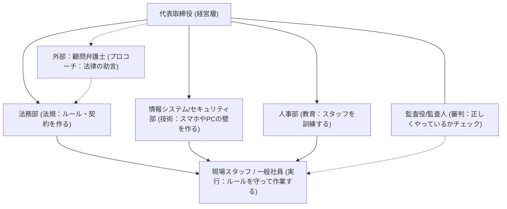

# CarlockHomes 採用サイト：組織図と役割分担

情報を守るために、社内と社外でどのような役割を分担すべきかをまとめたガイドです。
---

## 🏛️ 組織の全体像 (Mermaidによる視覚化)

## 🛡️ 各ポジションの役割解説

### 1. 監査役/監査人 (審判・ジャッジ)
会社が「ズルをしていないか」「危ないことをしていないか」を、客観的にチェックします。経営陣に対しても意見を言える、独立した立場です。

### 2. 顧問弁護士 (プロコーチ・外部顧問)
法律の専門家として、契約書のチェックやトラブル発生時の交渉を行います。会社にとっては「法律の武器」を提供してくれる存在です。

### 3. 法務部 (ルール作り・社内法務)
社内のルール（就業規則や契約のひな型）を整備します。監査人が「正しくやっているか」を見るのに対し、法務部は「正しく実行する」実務を担います。

### 4. 情報システム/セキュリティ部 (城壁・エンジニア)
デジタルのセキュリティ（スマホ管理、ウイルス対策、パスワード設定）を実際に担当します。技術で情報をブロックする役割です。

---

## 🚨 トラブル発生時の動き (危機管理)

1.  **現場スタッフ**: 異常を発見したら、即座に「上司」と「セキュリティ部」に報告。
2.  **セキュリティ部**: すぐにネットワークを遮断し、被害の拡大を防ぐ（被害の封じ込め）。
3.  **法務部・弁護士**: 法律的な影響を確認し、被害者への謝罪や公表の準備をする。
4.  **監査役**: この対応が正しく行われたか、不備がなかったかを事後に検証し、再発防止を促す。
