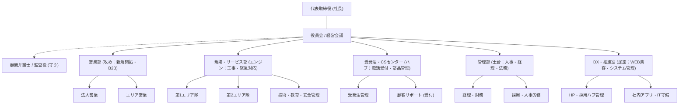

# 売上10億円規模から成長し続けるための中小企業 理想組織図

売上10億円の壁は、「社長一人の目が届く限界」です。これを越えて成長するためには、社長が「作業」を卒業し、「経営」に集中するための組織化（分業化）が不可欠です。
---

## 🏛️ 理想の組織図 (Mermaidによる視覚化)

---

## 🛡️ 10億円企業において「絶対に必要」となる3つの要点

### 1. 「管理部」と「DX・システム」の独立
売上規模が上がると、一人のミスが数千万円の損害を生む可能性があります。経理や人事を「事務のお手伝い」ではなく「管理の専門家」として独立させ、さらに私たちが進めているような「IT・システム」を会社の武器にする専門部隊が必要です。

### 2. 「中間リーダー（マネージャー層）」の育成
社長が全社員に直接指示を出す「直列組織」は10億円が限界です。各部門に部長・課長を置き、彼らが現場を回す「並列組織」へ移行しなければ、社長の時間が枯渇し、会社が止まってしまいます。

### 3. 「部門間のハブ」となるCSセンター
現場スタッフが技術作業に集中できるよう、電話受付、受発注、顧客対応を一箇所に集約したハブ（CSセンター）を作ることが、サービス品質の向上と現場の稼働率アップの鍵となります。

---

## 📈 この組織図が目指す「次なる一歩」

この組織図は、ただ部署を分けるだけでなく、各部門が「自走」することを目指しています。

*   **攻め（営業・DX）**が新しい市場を開拓し、
*   **稼ぎ（サービス・CS）**が現場で確実な価値（売上）に変換し、
*   **守り（管理・法務）**がその利益の土台を固める。

このサイクルが回ることで、10億円から25億円、50億円、そして100億円へと安定して成長することができます。
