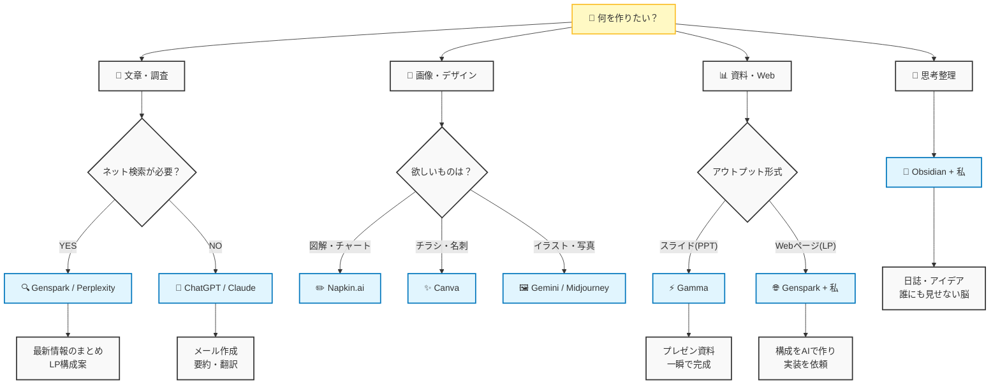

# 🤖 迷わない！AIツールの選び方フローチャート

「今、どのAIを使えばいいの？」と迷った時に見るチャートです。
（Mermaid記法で書かれているので、Obsidianで見ると綺麗な図になります！）

## 🎯 ケース別おすすめパターン

### 1. 「上司に提出する調査レポートを作りたい！」
*   **ルート**: 文章・調査 -> 検索あり -> **Genspark**
*   **理由**: ネットの最新情報を踏まえて、根拠のあるレポートを作ってくれるから。

### 2. 「明日の会議のプレゼン資料がない！ヤバい！」
*   **ルート**: 資料・Web -> スライド -> **Gamma**
*   **理由**: タイトルを入れるだけで、数分でスライド一式が完成するから。

### 3. 「文字ばかりの資料で分かりにくいと言われた…」
*   **ルート**: 画像・デザイン -> 図解 -> **Napkin**
*   **理由**: 文章をコピペするだけで、分かりやすい図解やグラフにしてくれるから。

### 4. 「自分の考えがまとまらない…壁打ちしたい」
*   **ルート**: 思考整理 -> **Antigravity（私）**
*   **理由**: 文子さんの文脈を一番理解しているパートナーだから。
