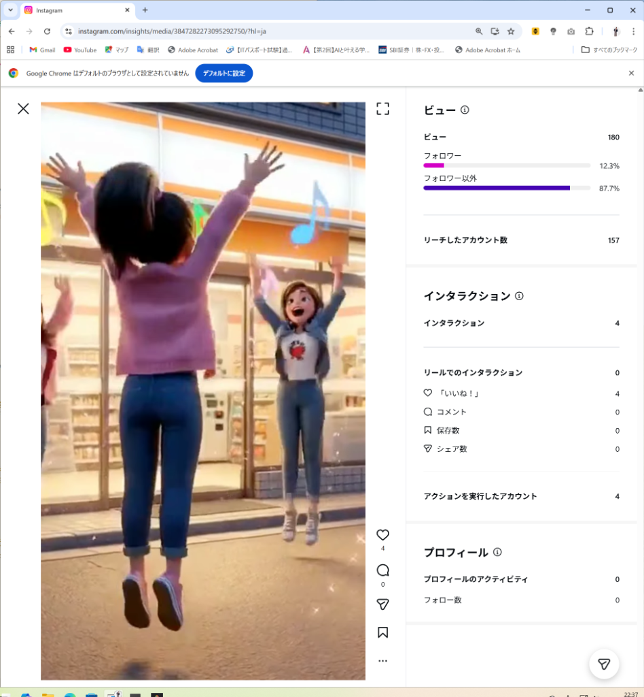
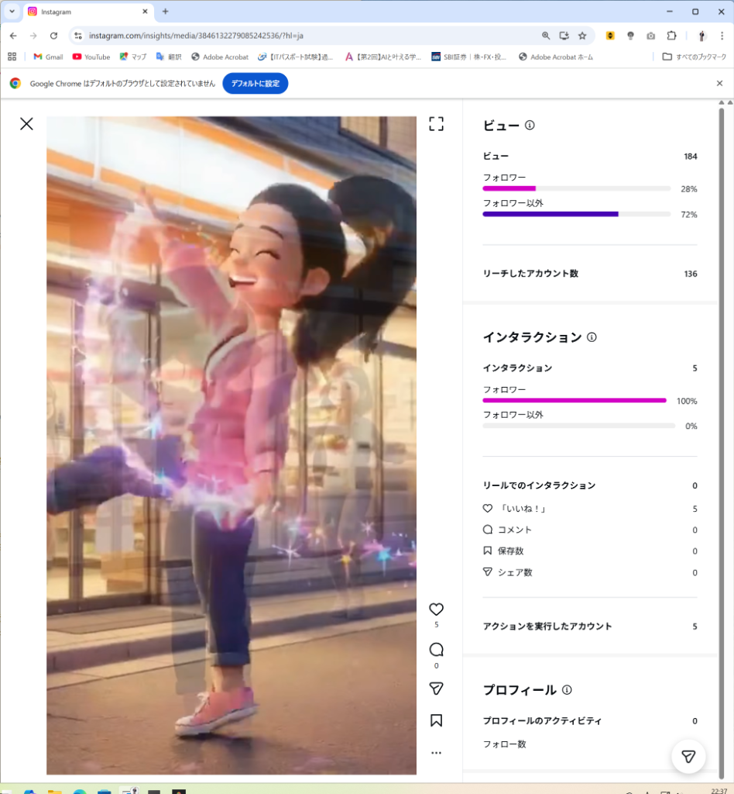
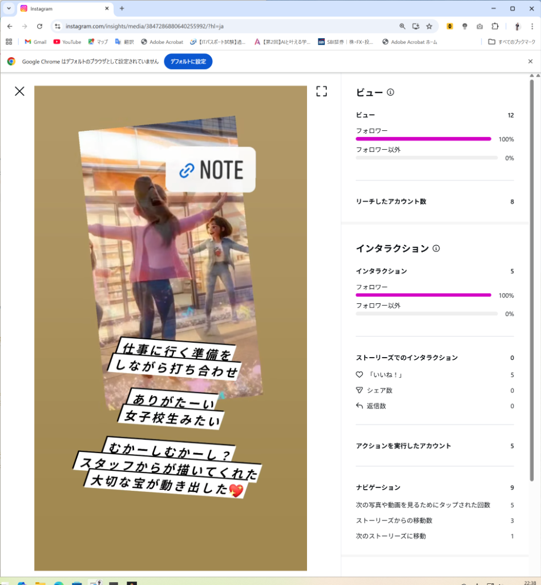

# 🎯 M-Lab SNSインサイト：コンテンツ別「オーディエンス」比較レポート
※各々のInstagram投稿（2種類のリールとストーリーズ）が、**「誰に届き、誰の心を動かしたのか」**を比較分析したレポートです。

---
# 1️⃣ リール動画A（The Spice of Love：コンビニ前ジャンプ）
### 【役割】圧倒的な「新規開拓（ディスカバリー）」

**【どこに届いたか（リーチ層）】**
*   リーチ総数：157人
*   **フォロワー外（新規）：87.7%（約137人）**
*   既存フォロワー：12.3%（約20人）

**【誰の心を動かしたか（アクション層）】**
*   いいね！：4件
*   （※内訳は不明だが、数は少なめ）

**【分析💡】**
この動画は、「M-Labをまだ知らない新しい人」に届ける能力に特化しています。**「広く浅く、まずは知ってもらう」ための最強の入り口（看板）**として機能しています。

---
# 2️⃣ リール動画B（魔法のエフェクト付き動画）
### 【役割】新規層への露出 ＋ 既存層の応援

**【どこに届いたか（リーチ層）】**
*   リーチ総数：136人
*   **フォロワー外（新規）：72.0%（約98人）**
*   既存フォロワー：28.0%（約38人）

**【誰の心を動かしたか（アクション層）】**
*   いいね！：5件
*   **いいね！の内訳：既存フォロワー100% / フォロワー外0%**

**【分析💡】**
動画Aと同様に、新規層へしっかりリーチしています。しかし、注目すべきは「アクション」です。新規層は見ているだけで通り過ぎてしまい、**「いいね！」を押して応援のアクションを起こしてくれているのは全員が『既存のファン』**という結果明確に出ました。新規をファンに変える「フック」の必要性を教えてくれる貴重なデータです。

---
# 3️⃣ ストーリーズ（「スタッフが描いてくれた宝物」）
### 【役割】圧倒的な「ファン共感（ナーチャリング）」

**【どこに届いたか（リーチ層）】**
*   リーチ総数：8人
*   **フォロワー外（新規）：0%（ストーリーズの特性上、基本はフォロワーのみ）**
*   既存フォロワー：100%（8人）

**【誰の心を動かしたか（アクション層）】**
*   いいね！：5件
*   **驚異のエンゲージメント率：62.5%（8人見て5人がいいね！）**

**【分析💡】**
リーチ数（見られた数）はリールに比べて極端に少ないですが、**「見た人のうちどれだけ心が動いたか」という点ではズバ抜けています。**
リールが「看板」だとすれば、このエモいストーリーは「秘密基地（アトリエ）でのおもてなし」。一度中に入ってきてくれた人を、熱狂的なファンに変えるための「最強の内装」であることが分かります。

---
# 🚀 結論：「誰に」「何を」届けるかの完璧な分業

3つのデータを比較することで、「それぞれの層」に対するアプローチの役割がより鮮明になりました。

1.  **【リール】は「知らない100人（フォロワー外）」を連れてくるための客引き担当。**
    👉 「すごい！」「面白い！」と思わせる映像とフックが必要。
2.  **【ストーリーズ】は「知っている8人（既存フォロワー）」を泣かせるおもてなし担当。**
    👉 「人間味」「苦労」「感謝（宝物）」といったエピソードが必要。

**【今後の戦略✨】**
この「ストーリーズの持つ強烈なおもてなし力（スタッフとの絆エピソードなど）」を、客引き担当である【リール】の看板にデカデカと貼り出したのが、今回の「投稿ドラフト」です！
リールで連れてきた大量の新規を、そのままストーリーズレベルの感動でファンにしてしまいましょう！
