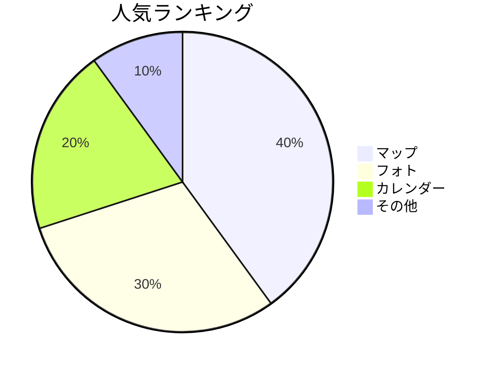
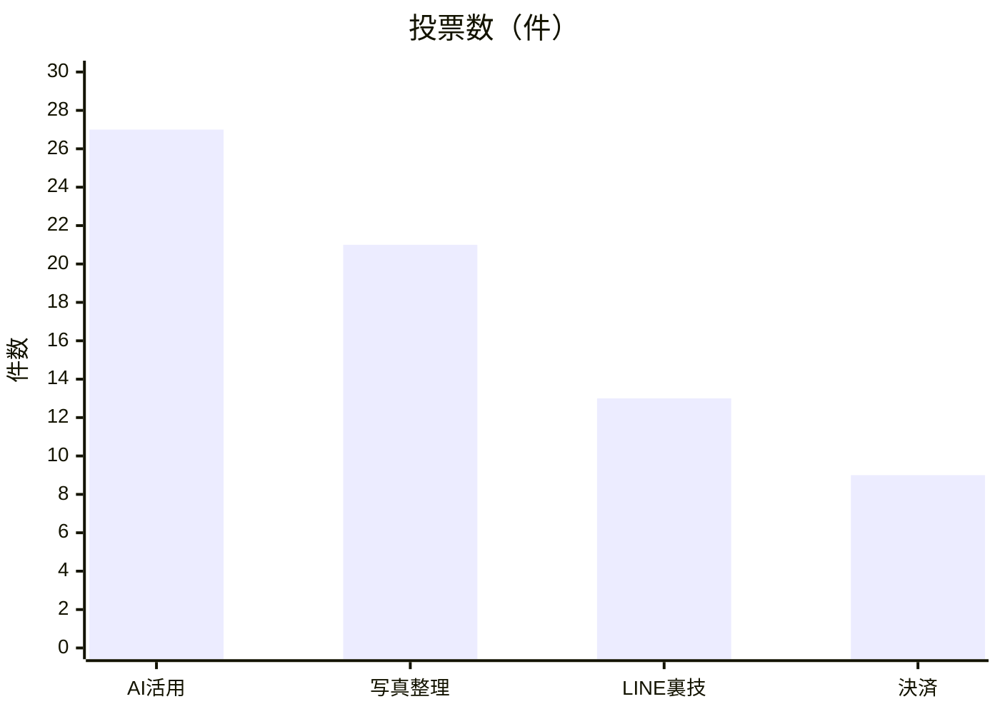

# 📊 アンケート集計結果（サンプル）

Obsidianの中で**「グラフ」**を表示させる実験です！
（Mermaidという機能を使っています）

---

## Q1. 今日の講習会で一番興味があったのは？

> **🦁 ⭐⭐⭐ おまつさんの一言**
> これはObsidianの中で描画している円グラフです！

---

## Q2. 次回やってほしいテーマはありますか？

> **🦁 ⭐⭐⭐ おまつさんの一言**
> これもObsidian上で表示される棒グラフです。（表示されない場合はObsidianのアップデートが必要かも！）

---

Created by おまつさん ⭐⭐⭐

